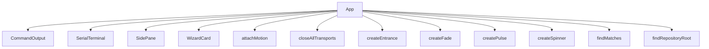

<!-- generated documentation — edit the source, not this file -->
# `tools/tui/src/app.tsx`

**depends on** [`tools/tui/src/devices.ts`](devices.ts.md), [`tools/tui/src/jobs.ts`](jobs.ts.md), [`tools/tui/src/motion.ts`](motion.ts.md), [`tools/tui/src/search.ts`](search.ts.md), [`tools/tui/src/serial.ts`](serial.ts.md), [`tools/tui/src/targets.ts`](targets.ts.md), [`tools/tui/src/terminal.ts`](terminal.ts.md), [`tools/tui/src/theme.ts`](theme.ts.md), [`tools/tui/src/types.ts`](types.ts.md), [`tools/tui/src/wizard.ts`](wizard.ts.md)  ·  **used by** [`tools/tui/src/main.tsx`](main.tsx.md)

## API

### `const clock = (value: number): string =>`
`tools/tui/src/app.tsx:116`

Format a millisecond timestamp as a clock time with hours, minutes, and seconds.

**called by** `CommandOutput`

### `export const findRepositoryRoot = (start = process.cwd()):`
`tools/tui/src/app.tsx:124`

Returns found:false rather than a bare path when the walk fails. Silently
falling back to cwd is the worst outcome available: prerequisite checks,
artifact staleness, and every job's working directory would all still answer,
but about the wrong tree, so the workspace looks broken instead of misplaced.
The released standalone binary is the case that reaches this.

**called by** `App`

### `const delay = (milliseconds: number) => new Promise((resolve) => setTimeout(resolve, milliseconds))`
`tools/tui/src/app.tsx:137`

Return a promise that resolves after the given number of milliseconds.

**called by** `pairingCodes`, `reconnectAfterFlash`, `runDiagnostics`

### `function HelpGroup(props: { title: string; rows: HelpRow[] })`
`tools/tui/src/app.tsx:141`

Render a help section as a column of command/description rows with the given title. Each row
shows the command name in fixed width followed by the muted description.

**called by** `HelpPanel`

### `const restingColor = (entry: ActivityEntry) =>`
`tools/tui/src/app.tsx:202`

Return the base color for an activity entry: muted for info messages, otherwise the severity
color (warn, error, etc.).

**called by** `colorFor`

### `const colorFor = (entry: ActivityEntry, newest: boolean) =>`
`tools/tui/src/app.tsx:207`

Only the newest line animates, so the cost of the arrival fade stays flat no
matter how much has scrolled past.

**called by** `CommandOutput`  ·  **calls** `restingColor`, `settle`

### `const prefixFor = (entry: ActivityEntry) =>`
`tools/tui/src/app.tsx:214`

Return the prefix string for an activity entry based on its kind and severity: "> " for
commands, "error: " for error messages, "notice: " for warnings, and "" otherwise.

**called by** `CommandOutput`

### `const visible = () => props.activity.slice(-300)`
`tools/tui/src/app.tsx:222`

Return the last 300 activity entries for display.

**called by** `CommandOutput`

### `const query = () => props.query ?? ""`
`tools/tui/src/app.tsx:281`

Return the current search query string, or "" if none is set.

**called by** `SerialTerminal`, `status`

### `const currentLine = () => matches()[props.matchIndex ?? 0]`
`tools/tui/src/app.tsx:284`

Return the currently selected line in the serial search results, indexed by matchIndex.

**called by** `SerialTerminal`

### `const status = () =>`
`tools/tui/src/app.tsx:289`

While searching, the rule is the search box: the count is the only thing
that says whether the term is anywhere in the scrollback at all, so it
outranks every connection detail until Esc puts them back.

**called by** `SerialTerminal`  ·  **calls** `matchSummary`, `query`

### `export function PairingPayload(props: { pairing?: BoardState["pairing"]; compact?: boolean })`
`tools/tui/src/app.tsx:374`

Display a QR code and optional manual code from a Matter pairing payload. Shows only if pairing
data is present. The QR height is compact (5 rows) or full (18 rows) depending on the compact
prop.

**called by** `SidePane`

### `const chrome = () => (props.view.danger ? theme.danger : props.chrome)`
`tools/tui/src/app.tsx:420`

Return the border color for the enclosing WizardCard: the danger color if the card is marked
dangerous, otherwise the provided chrome color.

**called by** `WizardCard`

### `const titleColor = () =>`
`tools/tui/src/app.tsx:424`

Return the border color for the enclosing WizardCard title: the danger color if the card is
marked dangerous, otherwise a color interpolated from muted to foreground based on the arrival
fade.

**called by** `WizardCard`  ·  **calls** `settle`

### `const hints = () => [ props.spinner ?? "", "q close", ...(props.canGoBack ? ["← back"] : []), "↑↓ choose", "Enter", "Tab command" ]`
`tools/tui/src/app.tsx:430`

Ranked so the two ways out of a screen outlive the refinements when the rule
runs short. The spinner leads only while it exists, because a running job is
the one thing more urgent than knowing how to leave.

**called by** `WizardCard`

### `const workflowBusy = () => activeWorkflowState() !== undefined`
`tools/tui/src/app.tsx:708`

Return true if a workflow is currently running, false if idle.

**called by** `cancelWorkflow`, `handleWizardAction`, `rejectDuringWorkflow`

### `const patchBoard = (id: BoardId, fn: (value: BoardState) => BoardState) =>`
`tools/tui/src/app.tsx:730`

Update a board's state in the boards map by applying a function to its current value.

**called by** `closeTransport`, `connectOnce`, `executeWorkflow`, `runFactoryReset`, `send`

### `const report = (text: string, severity: Severity = "info") =>`
`tools/tui/src/app.tsx:735`

Report a message to the activity log with the given severity and trim the log to the last 300
entries.

**called by** `App`, `askConfirmation`, `cancelWorkflow`, `choosePane`, `connectOnce`, `controlCapture`, `controlLab`, `disconnect`

### `const recordCommand = (text: string) =>`
`tools/tui/src/app.tsx:739`

Record a command in the activity log and trim the log to the last 300 entries.

**called by** `submitPrompt`

### `const clearCommandOutput = () =>`
`tools/tui/src/app.tsx:748`

Clear the command output log and hide the help overlay.

**called by** `submitPrompt`

### `const focusCommand = () =>`
`tools/tui/src/app.tsx:764`

Set focus to the command input and blur the wizard select dropdown.

**called by** `focusWizard`, `handleGlobalKey`, `handleWizardAction`, `hideWizard`, `openSearch`

### `const revealMatch = (index: number) =>`
`tools/tui/src/app.tsx:773`

Bring the current hit into view. The scrollbox measures in rows and every
serial line is one row, so the match index is the row: centring it means
the lines around it are visible too, which is the reason to search a log.

**called by** `stepSearch`, `updateSearch`

### `const closeSearch = () =>`
`tools/tui/src/app.tsx:789`

Close the search overlay, restore the search state to defaults, and scroll the serial console
back to the live tail.

**called by** `handleGlobalKey`

### `const updateSearch = (value: string) =>`
`tools/tui/src/app.tsx:800`

Retyping restarts at the first hit rather than keeping an index that now
points into a different match list.

**called by** `App`  ·  **calls** `revealMatch`

### `const stepSearch = (delta: number) =>`
`tools/tui/src/app.tsx:808`

Step through search matches in the given direction (delta), wrapping at both ends. Brings the
new match into view.

**called by** `App`, `handleGlobalKey`  ·  **calls** `revealMatch`, `stepMatch`

### `patchBoard(id, () => updated)`
`tools/tui/src/app.tsx:963`

Apply the updated board state returned from a workflow execution.

### `const clear = () =>`
`tools/tui/src/app.tsx:1012`

Clear the connection attempt record for the given board and attempt number once that attempt
is complete. Used to stop tracking retries.

**called by** `clearSerialTerminal`, `closeAllTransports`

### `const commandFor = (kind: WorkflowJob, id: BoardId): string[] =>`
`tools/tui/src/app.tsx:1063`

Assemble the command array for a given workflow job on a given board. Substitutes environment
variables (IDF_EXPORT, ESP_MATTER_PATH, PORT) based on the target and job type. Returns an
empty array if the job is unknown.

**called by** `runSingleJob`

### `const askConfirmation = (action: DestructiveAction): void =>`
`tools/tui/src/app.tsx:1198`

Single entry point for every destructive action, from the wizard and from
the command prompt alike. Nothing calls the run* functions below directly,
so a new destructive path cannot accidentally ship without a confirmation.

**called by** `handleWizardAction`, `submitPrompt`  ·  **calls** `focusWizard`, `rejectDuringWorkflow`, `report`

### `const tailTo = (box: ScrollBoxRenderable | undefined) =>`
`tools/tui/src/app.tsx:1595`

Follow the tail ourselves instead of using the scrollbox's stickyScroll.
OpenTUI 0.4.5 scrolls one row past the end even when the content fits the
viewport, which silently hid the oldest line of every console and showed
nothing at all when only one line had arrived.

**called by** `App`

Undocumented (36)

- `HelpPanel`
- `CommandOutput` — tested: :keeps command, serial, and job output in separate panes@l215
- `SerialTerminal` — tested: :a search reports its hit count and highlights the matching console lines@l513; :a search that matches nothing says so instead of looking empty@l547; :an empty terminal buffer still reports an active serial connection@l292; :keeps command, serial, and job output in separate panes@l215; :the console shows every line it is given, including the first@l568
- `WizardCard` — tested: :shows the left-arrow shortcut when a wizard screen has a parent@l81
- `SidePane` — tested: :keeps command, serial, and job output in separate panes@l215; :renders captured commissioning data in the dedicated pairing pane@l307
- `App` — tested: :a destructive command typed at the prompt asks before it does anything@l333; :an idle workspace is completely still@l440; :ctrl+f searches the serial scrollback and esc puts the console back@l498; :every panel keeps its label in the border rule at both terminal shapes@l393; :factory reset typed at the prompt confirms and names the credentials it destroys@l348; :keeps console, output, wizard, and prompt separate at 80x24@l62; :moves from wizard choices to the expert prompt and renders complete help@l40; :pane on restores the most recently selected side pane@l190
- `clearSerialTerminal`
- `focusWizard`
- `openSearch`
- `hideWizard`
- `rejectDuringWorkflow`
- `cancelWorkflow`
- `refreshInventory`
- `closeTransport`
- `closeAllTransports`
- `quit`
- `selectBoard`
- `connectOnce`
- `connect`
- `reconnectAfterFlash`
- `disconnect`
- `send`
- `runSingleJob`
- `executeWorkflow`
- `stopBeforeNextJob`
- `runWorkflow`
- `runFactoryReset`
- `runDestructive`
- `pairingCodes`
- `runDiagnostics`
- `controlLab`
- `controlCapture`
- `choosePane`
- `handleWizardAction`
- `submitPrompt`
- `handleGlobalKey`

