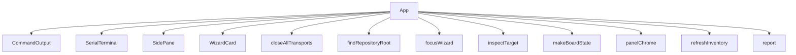

<!-- generated documentation — edit the source, not this file -->
# `tools/tui/src/app.tsx`

**depends on** [`tools/tui/src/devices.ts`](devices.ts.md), [`tools/tui/src/jobs.ts`](jobs.ts.md), [`tools/tui/src/serial.ts`](serial.ts.md), [`tools/tui/src/targets.ts`](targets.ts.md), [`tools/tui/src/terminal.ts`](terminal.ts.md), [`tools/tui/src/theme.ts`](theme.ts.md), [`tools/tui/src/types.ts`](types.ts.md), [`tools/tui/src/wizard.ts`](wizard.ts.md)  ·  **used by** [`tools/tui/src/main.tsx`](main.tsx.md)

## API

### `export const findRepositoryRoot = (start = process.cwd()):`
`tools/tui/src/app.tsx:119`

Returns found:false rather than a bare path when the walk fails. Silently
falling back to cwd is the worst outcome available: prerequisite checks,
artifact staleness, and every job's working directory would all still answer,
but about the wrong tree, so the workspace looks broken instead of misplaced.
The released standalone binary is the case that reaches this.

**called by** `App`

### `const colorFor = (entry: ActivityEntry, newest: boolean) =>`
`tools/tui/src/app.tsx:197`

Only the newest line animates, so the cost of the arrival fade stays flat no
matter how much has scrolled past.

**called by** `CommandOutput`  ·  **calls** `restingColor`, `settle`

### `const status = () =>`
`tools/tui/src/app.tsx:268`

Ranked so the state word survives on a narrow terminal and the scroll
reminder is the first thing dropped: knowing the port is dead matters more
than being reminded which key scrolls it.

**called by** `SerialTerminal`

### `const hints = () => [ props.spinner ?? "", "q close", ...(props.canGoBack ? ["← back"] : []), "↑↓ choose", "Enter", "Tab command" ]`
`tools/tui/src/app.tsx:370`

Ranked so the two ways out of a screen outlive the refinements when the rule
runs short. The spinner leads only while it exists, because a running job is
the one thing more urgent than knowing how to leave.

**called by** `WizardCard`

### `const askConfirmation = (action: DestructiveAction): void =>`
`tools/tui/src/app.tsx:1057`

Single entry point for every destructive action, from the wizard and from
the command prompt alike. Nothing calls the run* functions below directly,
so a new destructive path cannot accidentally ship without a confirmation.

**called by** `handleWizardAction`, `submitPrompt`  ·  **calls** `focusWizard`, `rejectDuringWorkflow`, `report`

Undocumented (53)

- `clock`
- `delay`
- `HelpGroup`
- `HelpPanel`
- `CommandOutput` — tested: :keeps command, serial, and job output in separate panes@l211
- `restingColor`
- `prefixFor`
- `visible`
- `SerialTerminal` — tested: :an empty terminal buffer still reports an active serial connection@l288; :keeps command, serial, and job output in separate panes@l211
- `PairingPayload`
- `WizardCard` — tested: :shows the left-arrow shortcut when a wizard screen has a parent@l79
- `chrome`
- `titleColor`
- `SidePane` — tested: :keeps command, serial, and job output in separate panes@l211; :renders captured commissioning data in the dedicated pairing pane@l303
- `App` — tested: :a destructive command typed at the prompt asks before it does anything@l329; :an idle workspace is completely still@l428; :every panel keeps its label in the border rule at both terminal shapes@l389; :factory reset typed at the prompt confirms and names the credentials it destroys@l344; :keeps output, wizard, and prompt separate at 80x24@l62; :moves from wizard choices to the expert prompt and renders complete help@l40; :moving the chrome into the borders gives the rows back to content@l409; :pane on restores the most recently selected side pane@l188
- `workflowBusy`
- `patchBoard`
- `report`
- `recordCommand`
- `clearSerialTerminal`
- `clearCommandOutput`
- `focusWizard`
- `focusCommand`
- `hideWizard`
- `rejectDuringWorkflow`
- `cancelWorkflow`
- `refreshInventory`
- `closeTransport`
- `closeAllTransports`
- `quit`
- `selectBoard`
- `connectOnce`
- `updated`
- `connect`
- `clear`
- `reconnectAfterFlash`
- `disconnect`
- `send`
- `commandFor`
- `runSingleJob`
- `executeWorkflow`
- `stopBeforeNextJob`
- `runWorkflow`
- `runFactoryReset`
- `runDestructive`
- `pairingCodes`
- `runDiagnostics`
- `controlLab`
- `controlCapture`
- `choosePane`
- `handleWizardAction`
- `submitPrompt`
- `handleGlobalKey`

