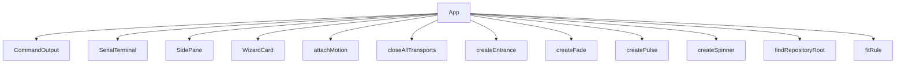

<!-- generated documentation — edit the source, not this file -->
# `tools/tui/src/app.tsx`

**depends on** [`tools/tui/src/devices.ts`](devices.ts.md), [`tools/tui/src/jobs.ts`](jobs.ts.md), [`tools/tui/src/motion.ts`](motion.ts.md), [`tools/tui/src/serial.ts`](serial.ts.md), [`tools/tui/src/targets.ts`](targets.ts.md), [`tools/tui/src/terminal.ts`](terminal.ts.md), [`tools/tui/src/theme.ts`](theme.ts.md), [`tools/tui/src/types.ts`](types.ts.md), [`tools/tui/src/wizard.ts`](wizard.ts.md)  ·  **used by** [`tools/tui/src/main.tsx`](main.tsx.md)

## API

### `export const findRepositoryRoot = (start = process.cwd()):`
`tools/tui/src/app.tsx:123`

Returns found:false rather than a bare path when the walk fails. Silently
falling back to cwd is the worst outcome available: prerequisite checks,
artifact staleness, and every job's working directory would all still answer,
but about the wrong tree, so the workspace looks broken instead of misplaced.
The released standalone binary is the case that reaches this.

**called by** `App`

### `const colorFor = (entry: ActivityEntry, newest: boolean) =>`
`tools/tui/src/app.tsx:201`

Only the newest line animates, so the cost of the arrival fade stays flat no
matter how much has scrolled past.

**called by** `CommandOutput`  ·  **calls** `restingColor`, `settle`

### `const status = () =>`
`tools/tui/src/app.tsx:278`

While searching, the rule is the search box: the count is the only thing
that says whether the term is anywhere in the scrollback at all, so it
outranks every connection detail until Esc puts them back.

**called by** `SerialTerminal`  ·  **calls** `query`

### `const hints = () => [ props.spinner ?? "", "q close", ...(props.canGoBack ? ["← back"] : []), "↑↓ choose", "Enter", "Tab command" ]`
`tools/tui/src/app.tsx:411`

Ranked so the two ways out of a screen outlive the refinements when the rule
runs short. The spinner leads only while it exists, because a running job is
the one thing more urgent than knowing how to leave.

**called by** `WizardCard`

### `const revealMatch = (index: number) =>`
`tools/tui/src/app.tsx:747`

Bring the current hit into view. The scrollbox measures in rows and every
serial line is one row, so the match index is the row: centring it means
the lines around it are visible too, which is the reason to search a log.

**called by** `stepSearch`, `updateSearch`

### `const updateSearch = (value: string) =>`
`tools/tui/src/app.tsx:772`

Retyping restarts at the first hit rather than keeping an index that now
points into a different match list.

**called by** `App`  ·  **calls** `revealMatch`

### `const askConfirmation = (action: DestructiveAction): void =>`
`tools/tui/src/app.tsx:1162`

Single entry point for every destructive action, from the wizard and from
the command prompt alike. Nothing calls the run* functions below directly,
so a new destructive path cannot accidentally ship without a confirmation.

**called by** `handleWizardAction`, `submitPrompt`  ·  **calls** `focusWizard`, `rejectDuringWorkflow`, `report`

### `const tailTo = (box: ScrollBoxRenderable | undefined) =>`
`tools/tui/src/app.tsx:1559`

Follow the tail ourselves instead of using the scrollbox's stickyScroll.
OpenTUI 0.4.5 scrolls one row past the end even when the content fits the
viewport, which silently hid the oldest line of every console and showed
nothing at all when only one line had arrived.

**called by** `App`

Undocumented (58)

- `clock`
- `delay`
- `HelpGroup`
- `HelpPanel`
- `CommandOutput` — tested: :keeps command, serial, and job output in separate panes@l215
- `restingColor`
- `prefixFor`
- `visible`
- `SerialTerminal` — tested: :a search reports its hit count and highlights the matching console lines@l513; :a search that matches nothing says so instead of looking empty@l547; :an empty terminal buffer still reports an active serial connection@l292; :keeps command, serial, and job output in separate panes@l215; :the console shows every line it is given, including the first@l568
- `query`
- `currentLine`
- `PairingPayload`
- `WizardCard` — tested: :shows the left-arrow shortcut when a wizard screen has a parent@l81
- `chrome`
- `titleColor`
- `SidePane` — tested: :keeps command, serial, and job output in separate panes@l215; :renders captured commissioning data in the dedicated pairing pane@l307
- `App` — tested: :a destructive command typed at the prompt asks before it does anything@l333; :an idle workspace is completely still@l440; :ctrl+f searches the serial scrollback and esc puts the console back@l498; :every panel keeps its label in the border rule at both terminal shapes@l393; :factory reset typed at the prompt confirms and names the credentials it destroys@l348; :keeps console, output, wizard, and prompt separate at 80x24@l62; :moves from wizard choices to the expert prompt and renders complete help@l40; :pane on restores the most recently selected side pane@l190
- `workflowBusy`
- `patchBoard`
- `report`
- `recordCommand`
- `clearSerialTerminal`
- `clearCommandOutput`
- `focusWizard`
- `focusCommand`
- `openSearch`
- `closeSearch`
- `stepSearch`
- `hideWizard`
- `rejectDuringWorkflow`
- `cancelWorkflow`
- `refreshInventory`
- `closeTransport`
- `closeAllTransports`
- `quit`
- `selectBoard`
- `connectOnce`
- `updated`
- `connect`
- `clear`
- `reconnectAfterFlash`
- `disconnect`
- `send`
- `commandFor`
- `runSingleJob`
- `executeWorkflow`
- `stopBeforeNextJob`
- `runWorkflow`
- `runFactoryReset`
- `runDestructive`
- `pairingCodes`
- `runDiagnostics`
- `controlLab`
- `controlCapture`
- `choosePane`
- `handleWizardAction`
- `submitPrompt`
- `handleGlobalKey`

