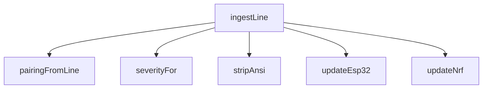

<!-- generated documentation — edit the source, not this file -->
# `tools/tui/src/devices.ts`

**depends on** [`tools/tui/src/theme.ts`](theme.ts.md), [`tools/tui/src/types.ts`](types.ts.md)  ·  **used by** [`tools/tui/src/app.tsx`](app.tsx.md)

## API

### `export function stripAnsi(value: string): string`
`tools/tui/src/devices.ts:9`

Strip ANSI escape sequences from the input string and return the plain text.

**called by** `ingestLine`

### `export function makeBoardState(id: BoardId): BoardState`
`tools/tui/src/devices.ts:15`

Create and return a BoardState record initialized with the given board ID, appropriate label and
theme color, and empty connection, diagnostic, log, and analyzer state.

**called by** `App`

### `function severityFor(line: string): Severity`
`tools/tui/src/devices.ts:35`

Return a severity tier (error, warning, success, or info) by scanning the console line for
keywords.

**called by** `ingestLine`

### `function pairingFromLine(current: BoardState["pairing"], line: string): BoardState["pairing"]`
`tools/tui/src/devices.ts:71`

Extract and merge QR code URL, QR content payload, and manual pairing code from a console line
into the current pairing state, returning the updated state or current state if no fields
matched.

**called by** `ingestLine`

Undocumented (3)

- `updateNrf`
- `updateEsp32`
- `ingestLine` — tested: :extracts a scannable matter payload and manual code from firmware output@l42; :extracts n rf matter shell onboarding output@l57; :extracts structured aliro lab events for the live analyzer@l37; :preserves bounded log history and flags failures@l29; :projects esp32 responder and ranging output into normalized bench state@l19; :projects the n rf curated shell into normalized bench state@l8

