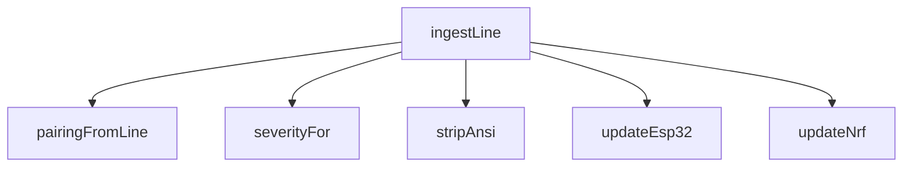

<!-- generated documentation — edit the source, not this file -->
# `tools/tui/src/devices.ts`

**depends on** [`tools/tui/src/theme.ts`](theme.ts.md), [`tools/tui/src/types.ts`](types.ts.md)  ·  **used by** [`tools/tui/src/app.tsx`](app.tsx.md)

Undocumented (7)

- `stripAnsi` — tested: :strips ansi presentation before parsing console state@l4
- `makeBoardState` — tested: :a search reports its hit count and highlights the matching console lines@l513; :a search that matches nothing says so instead of looking empty@l547; :an empty terminal buffer still reports an active serial connection@l292; :extracts a scannable matter payload and manual code from firmware output@l42; :extracts n rf matter shell onboarding output@l57; :extracts structured aliro lab events for the live analyzer@l37; :keeps command, serial, and job output in separate panes@l215; :preserves bounded log history and flags failures@l29
- `severityFor`
- `updateNrf`
- `updateEsp32`
- `pairingFromLine`
- `ingestLine` — tested: :extracts a scannable matter payload and manual code from firmware output@l42; :extracts n rf matter shell onboarding output@l57; :extracts structured aliro lab events for the live analyzer@l37; :preserves bounded log history and flags failures@l29; :projects esp32 responder and ranging output into normalized bench state@l19; :projects the n rf curated shell into normalized bench state@l8

