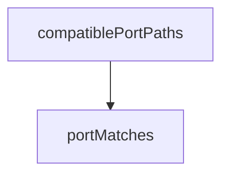

<!-- generated documentation — edit the source, not this file -->
# `tools/tui/src/targets.ts`

**depends on** [`tools/tui/src/serial.ts`](serial.ts.md), [`tools/tui/src/types.ts`](types.ts.md)  ·  **used by** [`tools/tui/src/app.tsx`](app.tsx.md), [`tools/tui/src/wizard.ts`](wizard.ts.md)

Undocumented (8)

- `newestMtime`
- `sourcePaths`
- `setupState`
- `portMatches`
- `compatiblePortPaths` — tested: :keeps ordinary esp serial candidates in natural order@l16; :prefers the n rf vcom1 console over the silent vcom0 interface@l4
- `preferredAvailablePort` — tested: :auto-connect chooses the preferred unused console and falls back safely@l28
- `inspectTarget`
- `path`

