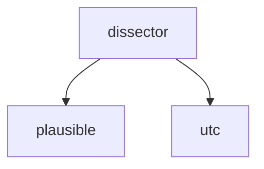

<!-- generated documentation — edit the source, not this file -->
# `tools/aliro.lua`

*No module docstring. First commit: "Add Wireshark dissector for the clear-text Aliro BLE plane".*

**discussed in** [`docs/protocol-research.md`](../../protocol-research.md), [`docs/wireshark.md`](../../wireshark.md)

Undocumented (4)

- `plausible`
- `utc`
- `adv.dissector`
- `ts.dissector`

