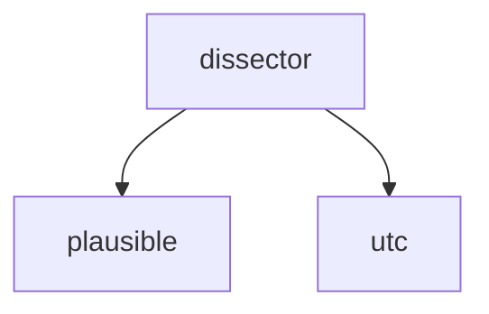

<!-- generated documentation — edit the source, not this file -->
# `tools/aliro.lua`

*No module docstring. First commit: "Add Wireshark dissector for the clear-text Aliro BLE plane".*

**discussed in** [`docs/protocol-research.md`](../../protocol-research.md), [`docs/wireshark.md`](../../wireshark.md)

## API

### `local function plausible(t) return t >= EXP_LO and t <= EXP_HI end`
`tools/aliro.lua:80`

Returns true if timestamp t falls within the plausible expiry range [EXP_LO, EXP_HI].

**called by** `adv.dissector`

### `local function utc(t) return os.date("!%Y-%m-%d %H:%M:%S UTC", t) end`
`tools/aliro.lua:82`

Converts a Unix timestamp t to an ISO 8601 UTC string in the format YYYY-MM-DD HH:MM:SS UTC.

**called by** `adv.dissector`

#### `function adv.dissector(tvb, pinfo, tree)`
`tools/aliro.lua:87`

Dissects an Aliro BLE advertisement from tvb. Parses flags (UWB flow, notification, version), TX
power, reader group ID, expiry timestamp (with UTC decoding and plausibility check), and dynamic
tag. Sets protocol name and info string; returns bytes consumed.

**calls** `plausible`, `utc`

#### `function ts.dissector(tvb, pinfo, tree)`
`tools/aliro.lua:175`

Dissects an Aliro Time Sync (Procedure 0) message from tvb. Expects 23 bytes: device count (8
LE), UWB time (8 LE), uncertainty (1), skew flag (1), max PPM (2 LE), success (1), retry count (2
LE). Sets protocol name and returns bytes consumed.
