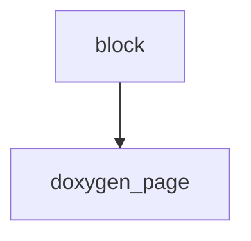

<!-- generated documentation — edit the source, not this file -->
# `tools/docs_apilinks.py`

Point each narrative page at the declarations it is describing.

The guides and the Doxygen tree are written for the same reader at two
different moments and never referred to each other: a page explains what the
STS ladder defends against and stops there, while `ccc_sts.h` states exactly
what the ladder is, three clicks away with no path between them.

This pass adds one block at the foot of the pages that have a counterpart —
the header the prose is about, with a line saying why it is the one to open.
The mapping is curated here rather than derived, because "the API this page
is about" is a judgement; what is not curated is whether the target exists.
Every header named below is resolved against the rendered tree and a miss
fails the build, so a renamed or newly-undocumented header cannot rot into a
dead link.

Doxygen omits undocumented symbols from the reference tree but still renders
a source view, so a header with no doc comments resolves to its source page
and the row says so.

Run from the repo root, after doxygen and after docs_nav.py (the block goes
above the pager, not below it), and before the link pass.

## API

### `doxygen_page(header: str) -> tuple[str, bool] | None`
`tools/docs_apilinks.py:95`

Resolve a header file name to its page in the rendered Doxygen tree, preferring the documented page over the source view. Returns (path relative to site/, documented) or None when the tree has neither.

**called by** `block`

### `block(entries: tuple[tuple[str, str], ...]) -> str | None`
`tools/docs_apilinks.py:104`

Render the cross-reference block for one page, or None if any header named for it is absent from the rendered tree.

**called by** `main`  ·  **calls** `doxygen_page`

### `main() -> int`
`tools/docs_apilinks.py:125`

Add an API cross-reference block to every narrative page that has one, above the reading-order pager. Reports what was linked; returns 1 when a page or a named header is missing.

**calls** `block`
