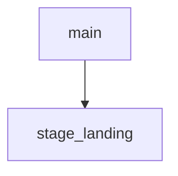

<!-- generated documentation — edit the source, not this file -->
# `tools/docs_hero.py`

Stage the site: a cinematic landing hero, and a reveal layer everywhere.

The page generator lays every page out the same way — a tinted band with a
title in it, then an article. That is correct and completely flat, and the
landing page in particular arrives looking like page 240 of the reference
tree rather than the front of anything. This pass adds the theatre, entirely
through injections into the rendered output; the generator is never edited.

Three things go in:

  * The landing hero becomes a dark room. `.hero-band` picks up a second
    class that redefines the theme's own custom properties inside it, so
    every child — buttons, the command chip, the terminal card, the stat
    row — restyles itself for a dark surface without a single one of them
    being touched by name. Behind the type, the concentric SVG the generator
    already draws in the corner is animated into UWB ranging pulses (this is
    a proximity-unlock reader; the rings are the product), over a drifting
    terracotta glow and a fine grain. The wordmark goes up to ~5.5rem of
    serif. The terminal tilts a few degrees out of the page.
  * The explore cards become a bento: three columns, with the first and last
    cell double-width, and the first promoted to a display card. Every card
    tracks the pointer with a soft spotlight.
  * Sitewide, section headings grow from 11px uppercase rails into serif
    headings, structural blocks fade up as they enter the viewport, the
    numbers in the hero count up once, and a hairline progress bar tracks
    reading position.

All of it is behind `prefers-reduced-motion`: the reveal layer resolves to
"already visible", the counters print their final value, the pulses and the
drift stop, and the terminal sits flat. The script is inert on a page with
none of these hooks, so guides and reference pages take only the heading and
reveal treatment.

Idempotent: a marker guards each injection, so re-running over a kept site/
changes nothing. Run from the repo root after docs_theme.py (it builds on the
tokens that pass defines) and before the link pass; it adds no links.

## API

### `stage_landing(page: str) -> tuple[str, list[str]]`
`tools/docs_hero.py:295`

Turn the landing hero into the dark room; report what was applied.

**called by** `main`

### `main() -> int`
`tools/docs_hero.py:312`

Inject the landing hero treatment and the sitewide reveal layer into the rendered site; report the pages touched.

**calls** `stage_landing`
