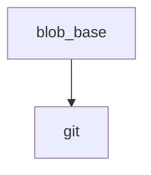

<!-- generated documentation — edit the source, not this file -->
# `tools/docs_links.py`

Repair cross-document links in the rendered site, then assert none are left broken.

The guide pages are authored as markdown that must also read correctly on GitHub,
so they link to other documents as `other.md` and to sources as `../modules/x.c`.
Neither form resolves once the pages are rendered into site/:

  * `other.md`            -> `other.html`, when that page was rendered
  * `../modules/x.c`      -> the file on GitHub, since sources are not published

Anything still unresolved after the rewrite is a genuine broken link and fails
the build. Run from the repo root, after both generators.

## API

### `blob_base() -> str`
`tools/docs_links.py:29`

github.com/<owner>/<repo>/blob/<branch> for the current remote, or '' if none.

**called by** `main`  ·  **calls** `git`

### `git(*args: str) -> str`
`tools/docs_links.py:31`

Run a git command and return its stripped output, or an empty string if the command fails or git is not found.

**called by** `blob_base`

### `_entries(directory: Path) -> dict[str, str]`
`tools/docs_links.py:57`

{lowercased name: real name} for a directory, cached. macOS is
case-insensitive, so `Path.exists()` happily confirms `ARCHITECTURE.html`
when the file on disk is `architecture.html`; a case-sensitive web host
then serves a 404. Every existence check here goes through this map so the
case a link claims is the case that actually exists.

**called by** `_exact`, `_real`

### `_real(path: Path) -> Path | None`
`tools/docs_links.py:71`

`path` with the casing it actually has on disk, or None when absent.

**called by** `fix`  ·  **calls** `_entries`

### `_exact(path: Path) -> bool`
`tools/docs_links.py:77`

True only when `path` exists with exactly this casing.

**called by** `main`  ·  **calls** `_entries`

### `main() -> int`
`tools/docs_links.py:82`

Rewrite all relative links in the rendered site: convert .md citations to .html pages, fix Doxygen's nonexistent bucket-index links, redirect repo-relative links to GitHub, and auto-link prose mentions of site/api/index.html. Verify that all remaining relative links resolve inside the site. Reports link rewrites and broken links (exit 1 if any remain). Requires site/ to exist and optionally a GitHub base URL.

**calls** `_exact`, `blob_base`

### `fix(match: re.Match[bytes]) -> bytes`
`tools/docs_links.py:97`

Replace or repair a single href attribute in an HTML file. Converts .md links to their rendered .html equivalents; fixes broken Doxygen bucket-index links; rewrites repo-relative links to GitHub blob URLs when a base URL is configured. Returns the replacement bytes or the original match if no fix applies.

**calls** `_real`
