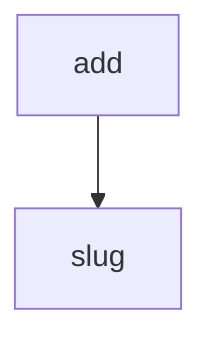

<!-- generated documentation — edit the source, not this file -->
# `tools/docs_modules.py`

Move the per-file reference listing off the landing page onto its own.

The generator ends index.html with every file in the tree — 331 of them at
this size, one row each, grouped by directory. That is a useful index and a
terrible last impression: it is roughly 60% of the landing page's bytes, it
buries the Guides section a reader actually wants, and nobody scrolls a
homepage looking for `ccc_shim_rx.c`.

This pass cuts that section out and republishes it as modules.html, so the
landing page ends at Guides and the listing gains a page where a directory
heading is a heading rather than a speed bump. The feature card that used to
jump to the #subsystems anchor now opens the page instead, and the listing
grows a per-directory jump strip, which the anchor version never had room
for.

Nothing here is curated: the rows, their order and their blurbs are the
generator's, moved verbatim. The page is assembled from an existing rendered
guide page, so it carries the current shell — sidebar, palette, theme toggle
and the other passes' injections.

Run from the repo root, after docs_nav.py (whose Guides regex still needs the
#subsystems heading in place) and before the link pass.

## API

### `slug(directory: str) -> str`
`tools/docs_modules.py:85`

Turn a source directory path into an HTML id usable as a jump-strip anchor.

**called by** `add`

### `anchored(listing: str) -> tuple[str, list[tuple[str, str]]]`
`tools/docs_modules.py:90`

Give every directory heading in the listing an id, and return the listing with the directory names and ids collected in page order.

**called by** `main`

### `add(m: re.Match) -> str`
`tools/docs_modules.py:94`

Rewrite one directory heading to carry an anchor id, recording it.

**calls** `slug`

### `build_page(template: str, listing: str, dirs: list[tuple[str, str]]) -> str`
`tools/docs_modules.py:104`

Render modules.html: the template shell with its hero and main column replaced by the moved listing, its jump strip and the cross-links to the two neighbouring reference trees.

**called by** `main`

### `wire_sidebar() -> int`
`tools/docs_modules.py:164`

Inject the sidebar Modules entry into every rendered page that has not got it already. Returns the number of pages changed.

**called by** `main`

### `add_search_row(title: str, page_name: str) -> None`
`tools/docs_modules.py:176`

Add an entry for the given page to the nav.js search array if not already present, so the palette finds the page by name. Does nothing silently if nav.js is absent.

**called by** `main`

### `main() -> int`
`tools/docs_modules.py:194`

Move the landing page's per-file reference listing into modules.html, repoint the feature card that used to jump to it, and register the new page with the search palette. Reports what moved; returns 1 if the landing page's layout no longer matches.

**calls** `add_search_row`, `anchored`, `build_page`, `wire_sidebar`
