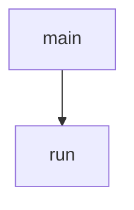

<!-- generated documentation — edit the source, not this file -->
# `tools/matter_cap_probe.py`

Add Aliro endpoint keys to a running lock until one is refused.

  python3 tools/matter_cap_probe.py --dry-run            check the key generator
  python3 tools/matter_cap_probe.py 1234-567-8901        walk into the ceiling
  python3 tools/matter_cap_probe.py <code> --long-discriminator 1459
  python3 tools/matter_cap_probe.py <code> --pre-clear 20 21

The lock advertises `ALIRO_TRUST_MAX` endpoint keys and cannot necessarily
persist that many. On the DWM3001CDK the settings partition is one 4096-byte
NVS sector shared with the fabric and the Thread dataset, and garbage collection
carries the OLD blob forward before the NEW one lands, so a write needs room for
both at once. The ceiling that follows is not a constant: it moves as ordinary
Matter traffic changes how much else is live in that sector. This measures where
it is today, and puts the store back afterwards.

Options: `--user` and `--index` pick the first slot pair to use, `--count` how
many to try, `--base` the anchor count already in the store so the running total
printed is the real one, `--pre-clear` removes credential indices a previous
interrupted run left behind, `--storage` moves the controller's key store.

Run `make monitor` alongside. The refusal the lock prints is the evidence:

    E:   credential type 7 REFUSED (-28)

-28 is -ENOSPC, and it is legible only because the provisioning paths propagate
the store's errno instead of collapsing it to -1. Anything else -- -1 above all
-- means the write was rejected for some other reason and says nothing about
capacity.

Like `matter_revoke_bench.py`, whose session and command helpers it borrows,
this NEVER commissions: it opens PASE against an open commissioning window and
invokes over that, consuming no fabric slot.

**depends on** [`tools/matter_revoke_bench.py`](matter_revoke_bench.md)

## API

### `_add(p, q)`
`tools/matter_cap_probe.py:55`

Affine point addition, doubling included. Never called on a curve secret.

**called by** `point`

### `point(k)`
`tools/matter_cap_probe.py:72`

k*G as an uncompressed 65-byte SEC1 point, which is what the lock stores.

**called by** `run`  ·  **calls** `_add`

### `_install(bench, mod, user, cred, key)`
`tools/matter_cap_probe.py:103`

SetUser then SetCredential, reporting only what the credential write said.

SetUser fails on its own for reasons that have nothing to do with capacity --
an index past the lock's user table answers InvalidCommand -- and the
credential still lands. Treating that as the ceiling ends the probe early.

**called by** `run`

Undocumented (2)

- `run`
- `main`

