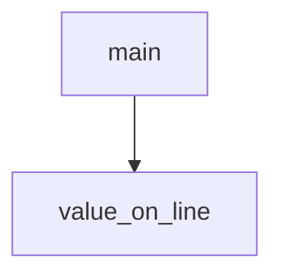

<!-- generated documentation — edit the source, not this file -->
# `web-twin/check_constants.py`

Verify that the web-twin's hardcoded firmware constants in index.html stay synchronized with their source definitions. Parses the FW table, reads the cited source lines, and reports any mismatches or missing citations.

**discussed in** [`web-twin/README.md`](../../../web-twin/README.md)

## API

### `value_on_line(value: str, line: str) -> bool`
`web-twin/check_constants.py:27`

Return true if the given value appears on the line as a standalone literal (not embedded in a longer number or identifier), allowing C integer suffixes like u.

**called by** `main`

### `main() -> int`
`web-twin/check_constants.py:34`

Parse the FW constant table from the web-twin index.html and verify that each cited constant matches the exact line and value in the source tree. Reports which constants drifted and returns 1 if any do; 0 if all are in sync.

**calls** `value_on_line`
